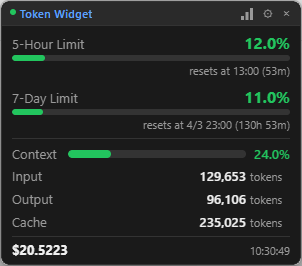
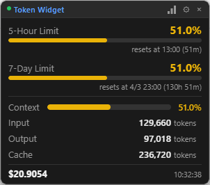
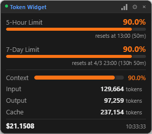
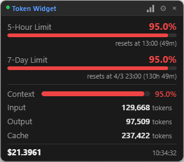

# Claude Code Token Widget

Claude Code のトークン使用量をリアルタイムで監視するデスクトップウィジェットです。

**Tauri 2.0** (Rust) + **Svelte 5** で構築。軽量で常駐に最適です。


| 通常 | 注意 | 警告 | 危険 |
|:----:|:----:|:----:|:----:|
|  |  |  |  |

使用率に応じてプログレスバーの色が自動で変化します。

## 主な機能

- **レート制限トラッキング** - 5時間/7日間の使用率とリセットまでのカウントダウン
- **コンテキストウィンドウ** - 使用率に応じて色が変わるプログレスバー
- **トークン統計** - 入力・出力・キャッシュリード・キャッシュ作成トークン
- **コスト表示** - USD/JPY 切り替え、為替レート手動設定可
- **OS通知アラート** - 使用率 50%/75%/90% でネイティブ通知
- **ヒートマップ** - 26週間の GitHub 風使用量履歴
- **ウェイクアップスケジューラ** - 指定時刻に Claude CLI を自動起動
- **システムトレイ** - ツールチップで主要指標を表示、表示/非表示切替
- **テーマ** - ダーク（デフォルト）/ ライト
- **カスタマイズ** - フォントサイズ (10-18px)、透明度 (30-100%)、表示項目の切替

## 前提条件

- **Claude Code** がインストール済みであること（[公式ガイド](https://docs.anthropic.com/en/docs/claude-code/overview)）
- **Windows 10 または 11**（x64）
  - Windows 10 の場合: [WebView2 Runtime](https://developer.microsoft.com/en-us/microsoft-edge/webview2/) が必要です（Windows 11 にはプリインストール済み）

## セットアップ手順

### ステップ 1: ウィジェットをダウンロード・インストール

1. [Releases ページ](https://github.com/creolab-dev/claude-code-token-widget/releases) を開く
2. 以下のいずれかをダウンロード:

   | ファイル | 説明 |
   |---------|------|
   | `Claude Code Token Widget_0.1.0_x64-setup.exe` | インストーラ（推奨） |
   | `Claude Code Token Widget_0.1.0_x64_en-US.msi` | MSI インストーラ |
   | `claude-code-token-widget.exe` | ポータブル版（インストール不要） |

3. インストーラを実行して画面の指示に従う、またはポータブル版の `.exe` を好きな場所に配置

### ステップ 2: statusline スクリプトを作成

ウィジェットは Claude Code が出力する JSON ファイル (`~/.claude/token-usage.json`) を読み取ります。このデータを受け取るスクリプトを作成します。

1. ターミナル（Git Bash、WSL など）を開いて以下を実行:

   ```bash
   cat > ~/.claude/statusline.sh << 'EOF'
   #!/bin/bash
   OUTFILE="$HOME/.claude/token-usage.json"
   TMPFILE="${OUTFILE}.tmp"

   INPUT=$(cat)

   if [ -n "$INPUT" ]; then
       echo "$INPUT" > "$TMPFILE" && mv "$TMPFILE" "$OUTFILE"
   fi
   EOF
   ```

2. スクリプトに実行権限を付与:

   ```bash
   chmod +x ~/.claude/statusline.sh
   ```

> **Windows のパスについて:** `~/.claude/` は Windows では `C:\Users\<ユーザー名>\.claude\` に対応します。

### ステップ 3: Claude Code のステータスラインを有効化

Claude Code の設定ファイルに `statusLine` を追加します。

1. `~/.claude/settings.json` をテキストエディタで開く
2. 以下を追加（既存の設定がある場合はマージしてください）:

   ```json
   {
     "statusLine": {
       "type": "command",
       "command": "bash ~/.claude/statusline.sh"
     }
   }
   ```

   既に他の設定がある場合は、既存の `{}` の中に `"statusLine"` キーを追加:

   ```json
   {
     "既存の設定": "...",
     "statusLine": {
       "type": "command",
       "command": "bash ~/.claude/statusline.sh"
     }
   }
   ```

### ステップ 4: 起動して確認

1. ウィジェットを起動（スタートメニューまたはポータブル版の `.exe`）
2. ターミナルで Claude Code を開き、会話を開始
3. 数秒以内にウィジェットにトークン使用量が表示される

**データが表示されない場合:**
- Claude Code が起動中で、会話がアクティブか確認
- `~/.claude/token-usage.json` が存在するか確認（最初のメッセージ送信後に作成されます）
- `settings.json` の `statusLine` 設定が正しいか確認

### ソースからビルド（任意）

前提: [Rust 1.94+](https://rustup.rs/)、[Node.js 18+](https://nodejs.org/)

```bash
git clone https://github.com/creolab-dev/claude-code-token-widget.git
cd claude-code-token-widget
npm install
npm run tauri build
```

バイナリは `src-tauri/target/release/bundle/` に出力されます。

## 使い方

画面下部のアイコンで 3 つのビューを切り替えられます:

| ビュー | 内容 |
|--------|------|
| **メイン** | レート制限、コンテキストウィンドウ、トークン、コスト、セッション情報 |
| **設定** | テーマ、フォントサイズ、透明度、通貨、アラート、表示項目 |
| **ヒートマップ** | 26週間の日次使用量（GitHub 風グリッド） |

### 設定項目

| 設定 | デフォルト | 範囲 |
|------|----------|------|
| テーマ | ダーク | ダーク / ライト |
| フォントサイズ | 12px | 10-18px |
| 透明度 | 100% | 30-100% |
| 通貨 | USD | USD / JPY |
| 為替レート | 150 | 手動入力 |
| 常に最前面 | オン | オン / オフ |
| アラート閾値 | 50%, 75%, 90% | 個別切替 |

### システムトレイ

トレイアイコンを右クリック:
- 表示 / 非表示
- 常に最前面の切替
- 終了

ツールチップ表示: `5H: X% | 7D: X% | Ctx: X%`

## パフォーマンス

| 指標 | 値 |
|------|-----|
| アイドルメモリ | 40 MB 以下 |
| アイドル CPU | 1% 以下 |
| 更新レイテンシ | 1 秒以下 |
| インストーラサイズ | 10 MB 以下 |

## 技術スタック

- **バックエンド**: Rust + Tauri 2.0
- **フロントエンド**: SvelteKit + Svelte 5 (Runes)
- **ファイル監視**: notify-debouncer-mini (100ms デバウンス) + 5秒ポーリングフォールバック
- **ストレージ**: tauri-plugin-store（設定 + ヒートマップ）
- **通知**: tauri-plugin-notification

## 開発

```bash
# 開発モード（ホットリロード）
npm run tauri dev

# 型チェック
npm run check

# 全テスト実行（Rust 55 + vitest 55）
npm run test:all

# Rust テストのみ
cd src-tauri && cargo test

# フロントエンドテストのみ
npm test
```

## ライセンス

MIT
